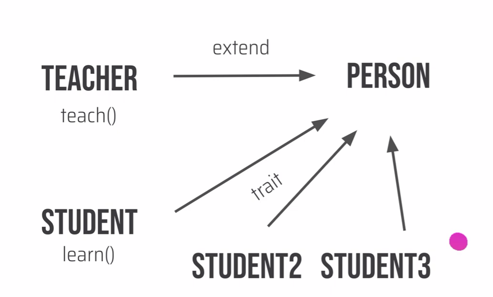
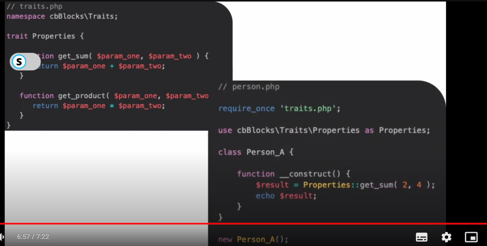
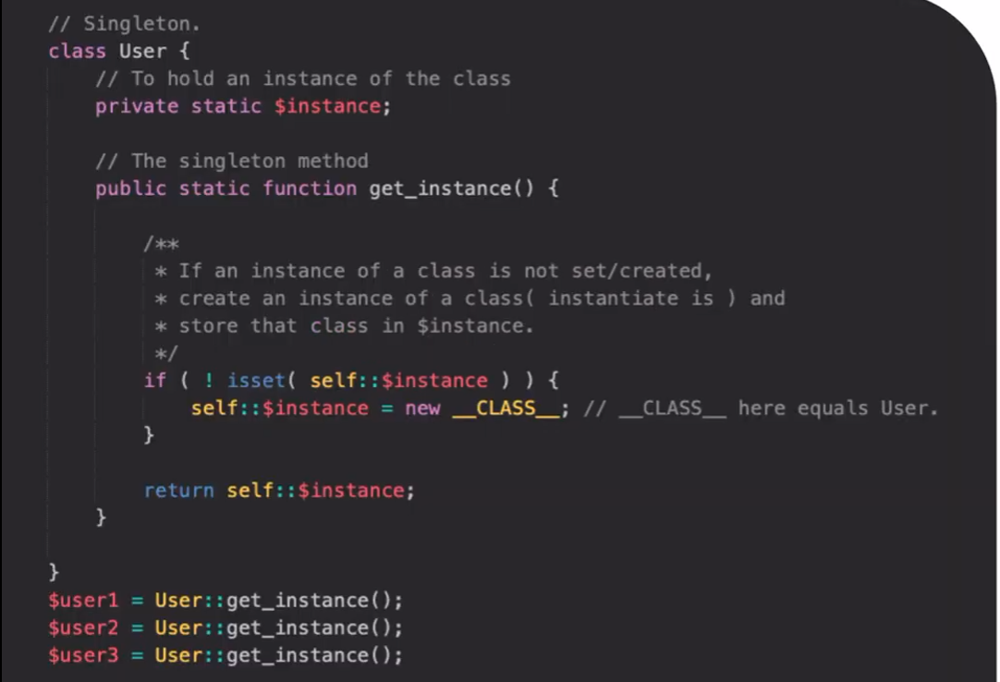

# Some important topics used in the theme:

# NAMESPACES
- A way of encapsulating items
- Like a virtual folder or directory defined with
namespace keyword at the top of the class file
followed by the name you like.
- Allow you to have two or more classes with the
same name in different namespaced directories

▷ Using Class in the Standard way:
1. class Product {} // define
2. $product = new Product(); // use

▷ Class Using Namespaces:

1. namespace App;
2. class Product {}
3. $product = new App\Product();
>> or,
3. use App;
4. $product = new Product();

# AUTOLOADERS
- Loading classes or interfaces automatically
- to avoid include_once, required_once several times

▷ SPL_AUTOLOAD_REGISTER()
- Registers any no. of autoloaders
- Enables classes and interfaces to be automatically
loaded if they are currently not defined
- Explained in my-php folder

# TRAITS

- Earlier we could only inherit properties and
Functions from one class to another, by
extending them.
- If we want the properties/methods of inherited
class into another, we need to extend it again which creates chain of inheritance.
- PHP (5.4+) introduced a mechanism for code
reusability called traits
TRAITS

- Traits allow us to reuse sets of methods freely in
several independent classes living in different
class hierarchies.
- Share functionalities from multiple classes
- A Trait is similar to a class, but only intended to
group functionality in a fine-grained and
consistent way
- It's not possible to instantiate a Trait on its own
- Explained in traits.php

# Singleton

▷ SINGLETON:
- The Singleton pattern is a design pattern that ensures a class has only one class instance and provides a global point of access to it
- It's used to restrict the instantiation of a class to a
single object
- Useful when only one object is required across the
system.

▷ Traditional way:
1. class User {};
2. $user1 = new User();
3. $user2 = new User();

▷ SignleTon:

# Enqueue Scripts:
//print_r( filemtime(get_template_directory() ."/style.css"));//checking version

function jagoron_enqueue_scripts()
{

    // Way-1(first register, then enqueue-css):  wp_register_style("style-css", get_stylesheet_uri(),[],filemtime(get_template_directory().'/style.css'),'all');
    // if(is_archive()){
    //    wp_enqueue_style("style-css"); //conditionally enqueue
    // }

    //Way-2 (enqueue-css): wp_enqueue_style("style-css", get_template_directory_uri() ."/style.css");

    //Way-3 (enqueue-css): wp_enqueue_style("style-css", get_stylesheet_uri(),[],filemtime(get_template_directory().'/style.css'),'all');//(name, path, ['dependency'],version number,media='all'/'print'/'screen'/'(max-width:640px)'/'(orientation:portrait)')

    //way-1(enqueue-js): wp_enqueue_script("main-js",get_template_directory_uri().'/assets/main.js',[], filemtime(get_template_directory().'/assets/main.js'),true); //(name, path, ['dependency'],version number,infooter==true/false)

    //way-2 (first register, then enqueue-js): wp_register_script("main-js",get_template_directory_uri().'/assets/main.js',[], filemtime(get_template_directory().'/assets/main.js'),true); 
    //wp_enqueue_script('main-js');

}
add_action("wp_enqueue_scripts", "jagoron_enqueue_scripts");